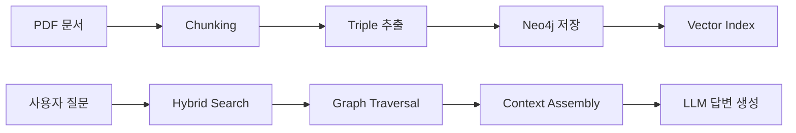

# TNFD-GraphRAG 시스템 구현 계획

TNFD(자연 관련 재무 정보 공개) 프레임워크를 기반으로 지속가능성 보고서를 분석하고, Knowledge Graph와 RAG를 결합한 질의응답 시스템 구축

---

## User Review Required

> [!IMPORTANT]
> **Neo4j 설정 확인 필요**
> - Neo4j AuraDB (클라우드) 또는 Docker 로컬 인스턴스 중 선호하는 방식 선택
> - 연결 정보 (URI, Username, Password) 준비

> [!WARNING]
> **API 키 필요**
> - Google Gemini API 키 (`GOOGLE_API_KEY`)
> - OpenAI API 키 (임베딩용, `OPENAI_API_KEY`) 또는 HuggingFace 로컬 임베딩 선택

---

## Proposed Changes

### 1. 프로젝트 구조

```
TNFD-GraphRAG_v1/
├── src/
│   ├── __init__.py
│   ├── config.py              # 환경 설정 및 상수
│   ├── schemas.py             # Pydantic 노드/관계 스키마
│   ├── data_pipeline/
│   │   ├── __init__.py
│   │   ├── pdf_loader.py      # PDF 로드 및 파싱
│   │   ├── chunker.py         # Semantic Chunking
│   │   └── glossary.py        # TNFD 용어집
│   ├── extraction/
│   │   ├── __init__.py
│   │   ├── prompts.py         # Few-shot 프롬프트
│   │   └── extractor.py       # Triple 추출 에이전트
│   ├── graph/
│   │   ├── __init__.py
│   │   ├── neo4j_client.py    # Neo4j 연결 및 CRUD
│   │   └── vector_store.py    # Vector Index 관리
│   └── retrieval/
│       ├── __init__.py
│       ├── hybrid_search.py   # 하이브리드 검색
│       ├── traversal.py       # Graph Traversal
│       └── generator.py       # 답변 생성
├── tests/
│   ├── __init__.py
│   ├── test_schemas.py
│   ├── test_chunker.py
│   └── test_extraction.py
├── data/
│   ├── pdfs/                  # 입력 PDF 파일
│   └── glossary/              # TNFD 용어집
├── scripts/
│   └── run_pipeline.py        # 전체 파이프라인 실행
├── .env.example
├── requirements.txt
└── README.md
```

---

### 2. 핵심 모듈 상세

#### [NEW] [requirements.txt](file:///c:/dev/python_pjt/TNFD-GraphRAG_v1/requirements.txt)

핵심 의존성:
- `pymupdf4llm` - PDF 파싱
- `langchain`, `langchain-google-genai` - LLM 오케스트레이션
- `neo4j` - 그래프 DB
- `pydantic` - 스키마 정의
- `python-dotenv` - 환경 변수

---

#### [NEW] [schemas.py](file:///c:/dev/python_pjt/TNFD-GraphRAG_v1/src/schemas.py)

Phase 1 MVP용 5개 핵심 노드 정의:

```python
class Organization(BaseModel):
    """분석 대상 기업/조직"""
    name: str
    industry_code: Optional[str] = None  # ISIC 코드

class Location(BaseModel):
    """사업장 또는 자산의 위치"""
    name: str
    coordinates: Optional[tuple[float, float]] = None
    country: Optional[str] = None

class Risk(BaseModel):
    """물리적/이행 리스크"""
    name: str
    category: Literal["Acute", "Chronic", "Transition"]
    financial_impact: Optional[str] = None

class Action(BaseModel):
    """완화 조치 및 전략"""
    name: str
    action_type: Literal["Avoid", "Reduce", "Restore", "Regenerate"]
    status: Optional[str] = None

class Evidence(BaseModel):
    """정보 출처 (텍스트 청크)"""
    text: str
    source_doc: str
    page_num: int
    embedding: Optional[list[float]] = None
```

---

#### [NEW] [extractor.py](file:///c:/dev/python_pjt/TNFD-GraphRAG_v1/src/extraction/extractor.py)

Few-shot 프롬프트 기반 Triple 추출:

```python
# 아키텍처 문서의 예시 프롬프트 활용
"""
Example:
Input: "We are implementing regenerative agriculture to reduce soil erosion..."
Output:
Nodes: [
  {id: "Regenerative Agriculture", type: "Action", class: "Reduce"},
  {id: "Soil Erosion", type: "DriverOfChange"},
  ...
]
Relationships: [
  ("Regenerative Agriculture", "MITIGATES", "Soil Erosion"),
  ...
]
"""
```

---

#### [NEW] [neo4j_client.py](file:///c:/dev/python_pjt/TNFD-GraphRAG_v1/src/graph/neo4j_client.py)

Neo4j 연결 및 그래프 저장:

- 노드 생성 (MERGE로 중복 방지)
- 관계 생성
- Vector Index 설정

---

#### [NEW] [hybrid_search.py](file:///c:/dev/python_pjt/TNFD-GraphRAG_v1/src/retrieval/hybrid_search.py)

하이브리드 검색:

1. Vector 유사도 검색 → Evidence 노드
2. Keyword 검색 → Entity 노드
3. Graph Traversal → 연결된 컨텍스트

---

### 3. 데이터 흐름



---

## Verification Plan

### Automated Tests

```bash
# 유닛 테스트 실행
cd c:\dev\python_pjt\TNFD-GraphRAG_v1
pytest tests/ -v
```

테스트 범위:
- `test_schemas.py` - Pydantic 모델 유효성 검증
- `test_chunker.py` - 청킹 로직 테스트
- `test_extraction.py` - Triple 추출 출력 형식 검증

### Manual Verification

1. **PDF 파이프라인 테스트**
   ```bash
   python scripts/run_pipeline.py --pdf data/pdfs/sample.pdf
   ```
   - 예상 결과: Neo4j에 노드/엣지 생성 확인

2. **질의응답 테스트**
   ```bash
   python -c "from src.retrieval.generator import query; print(query('이 기업의 주요 물리적 리스크는?'))"
   ```
   - 예상 결과: Risk 노드 기반 답변 + Evidence 출처 표시

3. **Neo4j Browser 검증**
   - 접속: `neo4j://localhost:7687` 또는 AuraDB Console
   - Cypher 쿼리: `MATCH (n) RETURN n LIMIT 50`
   - 노드 타입별 카운트 확인

---

## 구현 순서

1. **프로젝트 초기화** - 디렉토리 생성, requirements.txt
2. **스키마 정의** - schemas.py
3. **PDF 파이프라인** - pdf_loader.py, chunker.py
4. **Triple 추출** - prompts.py, extractor.py
5. **Neo4j 통합** - neo4j_client.py, vector_store.py
6. **Retrieval** - hybrid_search.py, generator.py
7. **테스트** - 유닛 테스트 및 통합 검증
